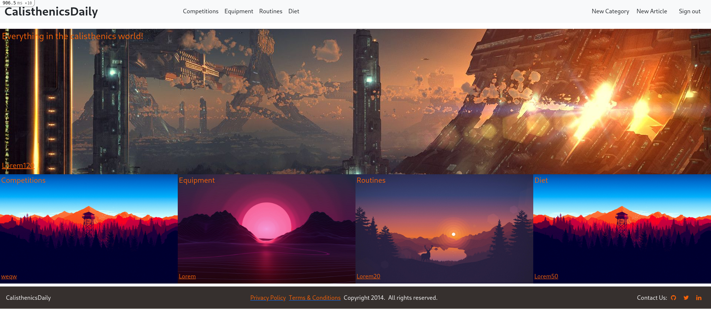
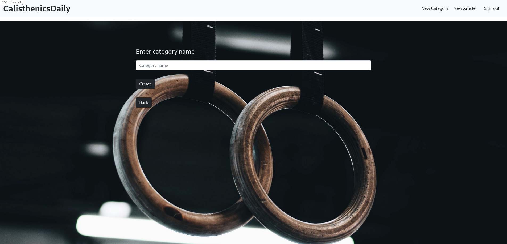
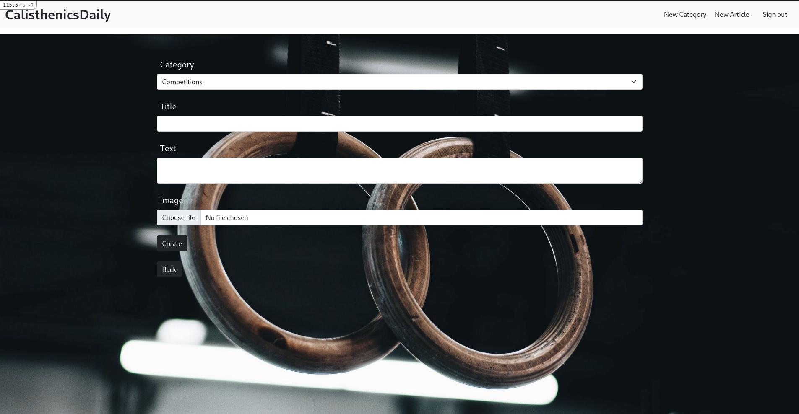
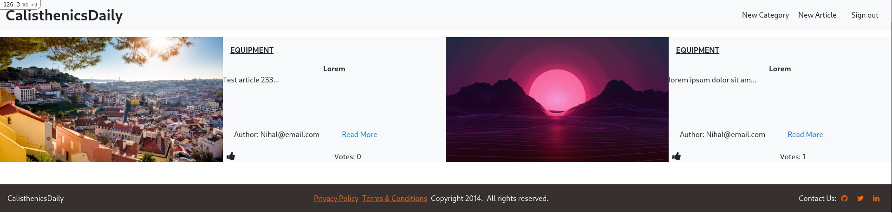

# CalisthenicsDaily












## About

This is an app built on rails according to the Microverse Ruby on Rails capstone assignment. 

When Signed in, the user can create new cateogories, articles and assign votes to preferred articles.

## Built With

- Ruvy
- Rails
- PostgreSQL
- Bootstrap
- Heroku
- Cloudinary

## Live Demo

[Live Demo Link](https://hidden-stream-62163.herokuapp.com/)


## Getting Started

To get a local copy up and running follow these simple example steps.

### Prerequisites

- Ruby 3.0.0
- Rails 6.1.3
- Postgresql

### Setup

Instal gems with:

```
  bundle
```

Instal yarn and webpacker with:

```
  yarn install
  rails webpacker:install
```

Database setip :

```
  rake db:create
  rake db:migrate
```

### Usage

Start rails server :

```
  rails s
```

Open the following in browser :

```
http://localhost:3000/
```

### Run tests

Open terminal

Run :

```
  bundle exec rspec
```

## Authors

👤 **Author**

- GitHub: [@apricot12](https://github.com/apricot12)
- Twitter: [@apricotfoxtrot](https://twitter.com/apricotfoxtrot)
- LinkedIn: [LinkedIn](https://linkedin.com/in/aprikot-web)

## 🤝 Contributing

Contributions, issues, and feature requests are welcome!

Feel free to check the [issues page](https://github.com/apricot12/Calisthenics-daily/issues).

## Show your support

Give a ⭐️ if you like this project!

## Acknowledgments

- [Nelson Sakwa](https://www.behance.net/sakwadesignstudio)


## 📝 License

This project is [MIT](./MIT.md) licensed.
